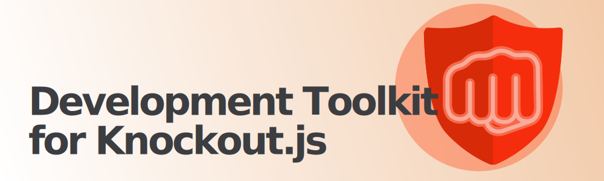

<!-- @include: ./docs/parts/intro.md -->

## What is Knuckles?

Knuckles is a development toolkit designed to enhance the developer experience (DX) using Knockout.js. It offers a range of useful tools for analyzing and optimizing Knockout.js applications. Each tool is entirely standalone and can be used independently.

> No knockout without knuckles! 👊

## Features

### Analyzer

The analyzer allows you to check for issues in Knockout views before production. It allows you to utilize external tools, such as [TypeScript](#typescript) and [ESLint](#eslint), to check the bindings, while also providing a set of useful rules to catch common misstakes. [Read more ›](/docs/analyzer/overview)

### TypeScript

As a plugin to the [analyzer](#analyzer), it can type-check the bindings in your Knockout views and provides a generated snapshot which other tools can use to provide type-aware analysis. [Read more ›](/docs/analyzer/typescript)

### ESLint

As a plugin to the [analyzer](#analyzer), it can lint bindings using existing rules for JavaScript and [TypeScript](#typescript) (with type-aware rules). [Read more ›](/docs/analyzer/eslint)

### SSR

Server-side rendering (SSR) allows you to render data into the view before handing it to the client to render. This can be used to greatly optimize runtime performance and SEO. [Read more ›](/docs/ssr/overview)

### Editor Support

Implementaion currently only exists for [VSCode](/packages/readme/vscode).

The [language server](/packages/readme/language-server) provides language features to Knockout views, such as "go to definition", highlighting, diagnostics (from [analyzer](#analyzer)).

<!-- /include -->

## License

All source code is licensed under the [MIT](https://choosealicense.com/licenses/mit/) license.

## Versioning

Verions adhear to [Semantic Versioning](https://semver.org/) (SemVer) v2.0.0.
